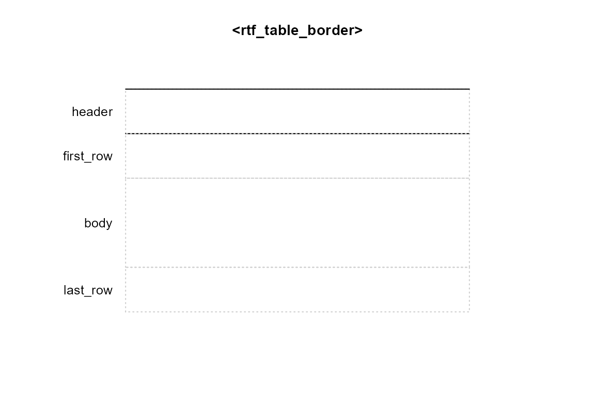
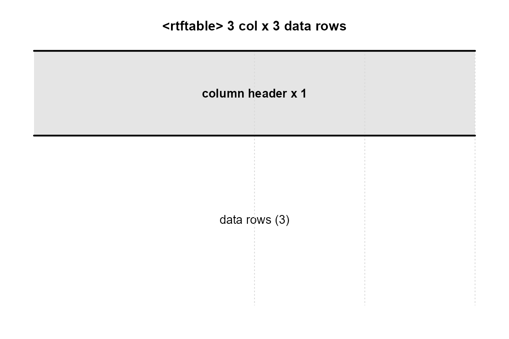
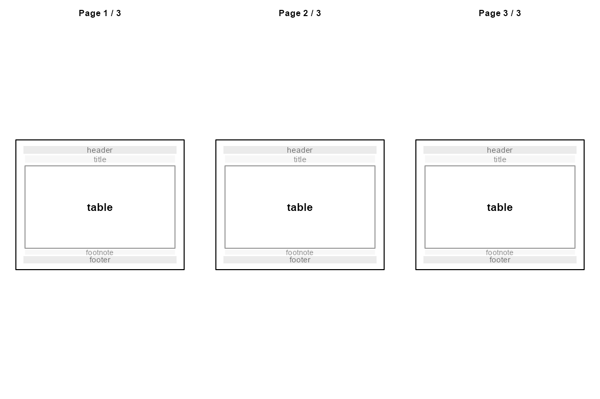

# S3 vs R6 in rtfreporter — a hands-on tour

`rtfreporter` is designed to be a small but realistic case study in how
to pick between R’s two main object systems, **S3** and **R6**, inside a
single package. This vignette walks through the choices using the
package’s own code as the example, and shows how to *see* the difference
in behaviour rather than just argue about it on paper.

``` r

library(rtfreporter)
```

------------------------------------------------------------------------

## TL;DR — the rule

> **Default to S3. Reach for R6 only when reference semantics genuinely
> change what the API can do.**

`rtfreporter` follows that rule:

| Class | System | Why |
|----|----|----|
| `rtf_border_side`, `rtf_border`, `rtf_table_border` | **S3** | Value objects. Copy-on-modify is the right semantics. |
| `rtf_table_style` | **S3** | Snapshot template; works fine without references. |
| `rtftable`, `rtfplot`, `rtfreport`, `rtf_document` | **S3** | Data records; round-trip through [`saveRDS()`](https://rdrr.io/r/base/readRDS.html). |
| **`rtf_theme`** | **R6** *(optional)* | Shared *mutable* defaults. This is the one case S3 cannot match cleanly. |

Everything else — borders, the snapshot style, the pipe document, even
the internal renderer scaffold — is plain S3. `Imports:` is empty; R6
lives in `Suggests:` and is only needed when you opt in to
[`rtf_theme()`](https://ichirio.github.io/rtfreporter/reference/rtf_theme.md).

------------------------------------------------------------------------

## 1. S3 in this package

S3 is R’s lightweight class system: a value is “of class X” if its
`class` attribute contains `"X"`. There is no formal type declaration,
no encapsulation, no inheritance enforcement. The trade-off is
simplicity — and that simplicity is exactly what most rtfreporter
objects want.

### Tagged-list constructors

``` r

b <- rtf_border(top = rtf_border_side(), bottom = rtf_border_side("double", 20L))
b
#> <rtf_border>
#>   top   : single, 15 twips
#>   bottom: double, 20 twips
#>   left  : none
#>   right : none
class(b)
#> [1] "rtf_border"
str(b, max.level = 2)
#> List of 4
#>  $ top   :List of 3
#>   ..$ style: chr "single"
#>   ..$ width: int 15
#>   ..$ color: NULL
#>   ..- attr(*, "class")= chr "rtf_border_side"
#>  $ bottom:List of 3
#>   ..$ style: chr "double"
#>   ..$ width: int 20
#>   ..$ color: NULL
#>   ..- attr(*, "class")= chr "rtf_border_side"
#>  $ left  : NULL
#>  $ right : NULL
#>  - attr(*, "class")= chr "rtf_border"
```

[`rtf_border()`](https://ichirio.github.io/rtfreporter/reference/rtf_border.md)
is just a function that builds a named list and stamps a class attribute
on it. You can poke around with
[`str()`](https://rdrr.io/r/utils/str.html),
[`dput()`](https://rdrr.io/r/base/dput.html) and
[`saveRDS()`](https://rdrr.io/r/base/readRDS.html) — every field is
plain data.

### S3 method dispatch

The [`print()`](https://rdrr.io/r/base/print.html) you saw above is
dispatched through
[`UseMethod()`](https://rdrr.io/r/base/UseMethod.html). The package
registers a small set of S3 methods (NAMESPACE):

``` r

methods(class = "rtf_border")
#> [1] plot  print
#> see '?methods' for accessing help and source code
methods(class = "rtf_table_border")
#> [1] plot  print
#> see '?methods' for accessing help and source code
methods(class = "rtftable")
#> [1] plot
#> see '?methods' for accessing help and source code
```

The [`plot()`](https://rdrr.io/r/graphics/plot.default.html) methods
(covered in §3 below) are S3 too. Adding a new behaviour for
`rtf_border` is as easy as defining a new `fn.rtf_border` function and
registering it.

### Copy semantics: borders are values, not handles

Because S3 lives in normal R values, *every* assignment makes a copy:

``` r

b1 <- rtf_border_top()
b2 <- b1                 # copy, not a reference
b2$top <- NULL           # mutating b2 …
b1$top                   # … does not affect b1
#> <rtf_border_side: single, 15 twips>
```

That is exactly what you want for things like borders: they are
self-contained values. Two tables that share the same border spec cannot
accidentally clobber each other.

### Functional derivation

When you do want a slightly modified copy, the package provides explicit
helper functions:

``` r

heavy_top <- rtf_border_with(b1, top = rtf_border_side("thick", 30L))
heavy_top
#> <rtf_border>
#>   top   : thick, 30 twips
#>   bottom: none
#>   left  : none
#>   right : none
identical(b1, heavy_top)   # b1 is unchanged
#> [1] FALSE
```

``` r

tfl       <- rtf_table_style_tfl()
tfl_bold  <- rtf_table_style_with(tfl, header_bold = TRUE)
c(tfl$header_bold, tfl_bold$header_bold)
#> [1] FALSE  TRUE
```

The pattern is “build, derive, build, derive” — fully functional,
nothing hidden behind references.

### The snapshot style: predictable, surprising-free

`rtf_table_style` is an S3 list that holds default values for
[`rtftable()`](https://ichirio.github.io/rtfreporter/reference/rtftable.md)
to consume. Critically, the values are **snapshotted at the time
[`rtftable()`](https://ichirio.github.io/rtfreporter/reference/rtftable.md)
runs**:

``` r

style <- rtf_table_style_tfl()
t1    <- rtftable(data.frame(A = 1:2), style = style)
style$header_bold <- TRUE                          # too late
t2    <- rtftable(data.frame(A = 1:2), style = style)
c(t1 = t1$col_spec[[1L]]$header_bold,
  t2 = t2$col_spec[[1L]]$header_bold)
#>    t1    t2 
#> FALSE  TRUE
```

`t1` snapshotted `header_bold = FALSE` at construction; the later
mutation to `style` only affects newly constructed tables. This
behaviour is intuitive, easy to reason about, and the right default for
a defaults bag.

------------------------------------------------------------------------

## 2. The one R6 class: `rtf_theme`

There is exactly one situation where rtfreporter wants the *opposite* of
snapshot semantics: a **shared mutable theme** that multiple tables
observe in real time. Suppose you have 20 tables in a report, all using
the same “company TFL look”, and partway through review you decide to
flip `header_bold` on globally.

With the S3 style you would either rebuild all 20 tables or pre-empt the
change at construction. With the R6 theme it is one assignment:

``` r

theme <- rtf_theme(header_bold = FALSE)
df1   <- data.frame(A = 1:2, B = c("x", "y"))
df2   <- data.frame(A = 3:4, B = c("p", "q"))
t1    <- rtftable(df1, theme = theme)
t2    <- rtftable(df2, theme = theme)

inherits(theme, "R6")
#> [1] TRUE
inherits(theme, "rtf_theme")
#> [1] TRUE

# Mutate the theme — every referencing table now renders bold headers
theme$header_bold <- TRUE
```

The trick is that
[`rtftable()`](https://ichirio.github.io/rtfreporter/reference/rtftable.md)
stores the R6 **reference** in `tbl$theme` and the renderer calls a
small internal helper (`.refresh_theme(tbl)`) before each render to
re-snapshot the theme’s current state. So `t1` and `t2` reflect the
mutation on their very next render with no rebuild.

This is the one trick S3 cannot do cleanly: S3 lists are copy-on-modify,
so a mutation to `theme` would never propagate to already-constructed
tables.

### Why R6 is *Suggests*, not *Imports*

[`rtf_theme()`](https://ichirio.github.io/rtfreporter/reference/rtf_theme.md)
is **gated** on the R6 package being installed. All other features —
including the snapshot `rtf_table_style` — work without R6. Users who
want shared mutable themes opt in with `install.packages("R6")`;
everyone else pays nothing.

``` r

# Without R6 installed, rtf_theme() errors helpfully:
tryCatch(rtf_theme(), error = function(e) conditionMessage(e))
```

### When to choose `rtf_theme` over `rtf_table_style`

A small decision tree:

- **One table, one set of defaults?** Pass arguments directly to
  [`rtftable()`](https://ichirio.github.io/rtfreporter/reference/rtftable.md).
  No style, no theme.
- **Many tables, defaults locked at build time?**
  [`rtf_table_style()`](https://ichirio.github.io/rtfreporter/reference/rtf_table_style.md).
- **Many tables, defaults you might want to retune after building?**
  [`rtf_theme()`](https://ichirio.github.io/rtfreporter/reference/rtf_theme.md)
  — but you take on a *Suggests* dependency.

------------------------------------------------------------------------

## 3. S3 method dispatch in action — the `plot()` methods

Beyond [`print()`](https://rdrr.io/r/base/print.html), the package
exposes a small [`plot()`](https://rdrr.io/r/graphics/plot.default.html)
family that takes advantage of S3 dispatch to give you a fast pre-render
inspection without leaving R.

### A border

``` r

plot(rtf_border(top    = rtf_border_side("thick", 30L),
                bottom = rtf_border_side("double", 20L),
                left   = rtf_border_side("dot")))
```


### A table border (zones)

``` r

plot(rtf_border_tfl())
```



### A table — layout wireframe

``` r

df <- data.frame(USUBJID = c("001-001", "001-002", "001-003"),
                 TRT     = c("Placebo", "Active",  "Active"),
                 AVAL    = c(12.3, 14.1, 11.7))
tbl <- rtftable(df, col_rel_width = c(2, 1, 1), row_height_twips = 280L)
plot(tbl)
```



### A document — page thumbnails

``` r

doc <- rtf_document()
doc <- rtf_section(doc, page = 1,
                   secinfo = list(header = rtf_header(c(l = "Demo")),
                                  footer = rtf_footer(c(c = "Confidential"))))
doc <- rtf_tables(doc, list(df, df, df))
plot(doc)
```



Each `plot.*()` method is one function. Dispatch is handled by
[`UseMethod()`](https://rdrr.io/r/base/UseMethod.html) — the same
mechanism as [`print()`](https://rdrr.io/r/base/print.html) and
[`summary()`](https://rdrr.io/r/base/summary.html). That is the entire
S3 method system: no class generators, no formal interface declarations,
no compile step.

------------------------------------------------------------------------

## 4. Putting the choice into your own packages

Use this list as a starting checklist. Pick S3 unless several rows push
you towards R6.

| Indicator | Lean toward |
|----|----|
| The object is a value the caller may freely copy. | S3 |
| Round-tripping via [`saveRDS()`](https://rdrr.io/r/base/readRDS.html) / [`dput()`](https://rdrr.io/r/base/dput.html) matters. | S3 |
| You want users to compose with `%>%` / `|>` (fresh copy each step). | S3 |
| The only methods you need are [`print()`](https://rdrr.io/r/base/print.html) / [`format()`](https://rdrr.io/r/base/format.html) / [`summary()`](https://rdrr.io/r/base/summary.html). | S3 |
| Multiple holders must observe in-place mutations. | **R6** |
| The object has long-lived state that outlives a single call. | **R6** |
| You need a chainable mutating builder (`x$set_a()$set_b()`). | R6 *(rare)* |
| You’re tempted by R6 mostly for “everything is a method”. | Resist — that’s a syntactic preference, not a semantic need. |

R6 is a powerful tool. But every R6 class in your package adds a
dependency, hides behaviour behind methods, and breaks the simple
“R-values are immutable” mental model. Used sparingly — exactly once in
rtfreporter — it gives you something you genuinely cannot build cleanly
any other way. Used reflexively it just adds noise.

------------------------------------------------------------------------

## See also

- `LEARNING.md` at the repository root — the design log this vignette
  distils.
- [`vignette("rtfreporter-quickstart")`](https://ichirio.github.io/rtfreporter/articles/rtfreporter-quickstart.md)
  — practical use of the package, not the design.
- [`?rtf_theme`](https://ichirio.github.io/rtfreporter/reference/rtf_theme.md)
  — full reference for the optional R6 theme.
